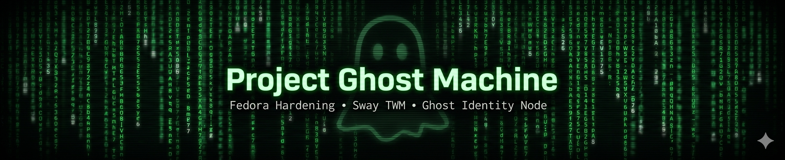
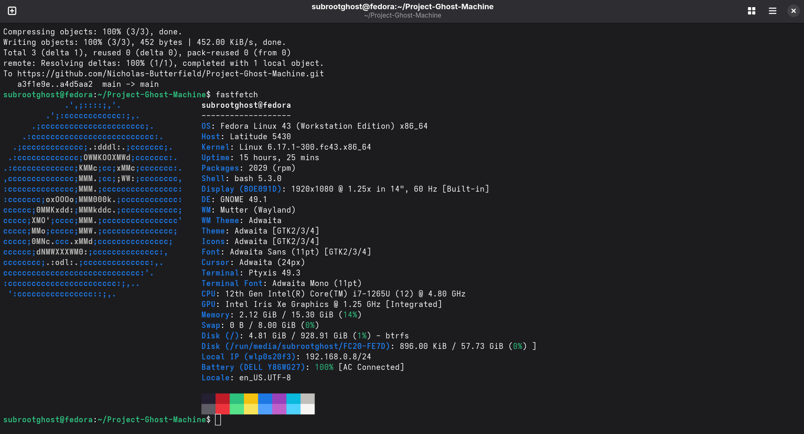

<!-- Banner -->

  

<h1 align="center">🜁 Project Ghost Machine</h1>
<h3 align="center">Fedora 43 Hardening • Sway TWM • 64GB Upgrade • Ghost Identity Node</h3>

  Transforming a Dell Latitude 5430 into a hardened Linux-based privacy and cybersecurity workstation.

---

## 🧭 Quick Overview

Project Ghost Machine is a full-system transformation of a Dell Latitude 5430 into a hardened, Linux‑based ghost identity node. This project documents the complete migration from Windows 11 Enterprise to Fedora 43, the implementation of the Sway tiling window manager, and the upcoming 64GB RAM hardware upgrade.

The goal is to create a secure, minimal‑surface‑area workstation optimized for privacy, cybersecurity workflows, and integration into a multi‑architecture home lab. Each phase includes evidence, benchmarks, configuration details, and hardening steps to provide a transparent, real‑world case study in system security engineering.

---

## 📚 Table of Contents
- [🧭 Phase Roadmap](#-phase-roadmap)
- [🖥️ Phase 1 — Software Migration (Completed)](#️-phase-1--software-migration-completed)
- [🛠️ Troubleshooting Log (2026-04-25)](#️-troubleshooting-log-2026-04-25)
- [🧩 Phase 2 — Hardware Upgrade (In Progress)](#-phase-2--hardware-upgrade-in-progress)
- [📊 Benchmarks](#-benchmarks)
- [🛡️ Phase 3 — System Hardening (Planned)](#️-phase-3--system-hardening-planned)
- [🪟 Phase 4 — Sway TWM Optimization (In Progress)](#-phase-4--sway-twm-optimization-in-progress)
- [📈 Phase 5 — Benchmarks & Analysis (Planned)](#-phase-5--benchmarks--analysis-planned)
- [🎯 Phase 6 — Threat Model (Planned)](#-phase-6--threat-model-planned)
- [🚀 Phase 7 — Future Enhancements (Planned)](#-phase-7--future-enhancements-planned)

---

## 🧭 Phase Roadmap

This project is structured into multiple phases to document the full transformation of the Dell Latitude 5430 into a hardened Linux-based ghost identity node. Each phase includes evidence, configuration details, and security considerations.

---

## 🖥️ Phase 1 — Software Migration (Completed)

- Migrated from Windows 11 Enterprise to Fedora 43  
- Implemented Sway TWM for minimal attack surface  
- Captured baseline RAM usage and system information  

### **Before & After Comparison**

| Windows 11 Enterprise (Original) | Fedora Linux (Current State) |
| :---: | :---: |
|  |  |
| *Figure 1: Windows 16GB Baseline* | *Figure 2: Fedora 16GB Baseline* |

> [!NOTE]  
> Physical memory currently remains at the **16GB factory baseline**. Documentation for the **64GB RAM upgrade** will be added following hardware installation.

---

## 🛠️ Troubleshooting Log (2026-04-25)

- **Identity Resolution**: Corrected remote origin from `subrootghost` to `Nicholas-Butterfield` to resolve `404 Not Found` authentication errors.  
- **Structural Conflict**: Resolved `CONFLICT (file/directory)` by migrating the local `config` file to a directory structure to match the repository HEAD.  
- **History Integration**: Utilized `--allow-unrelated-histories` to bridge the gap between the new local Acer setup and the existing Dell-originated GitHub repository.  

---

## 🧩 Phase 2 — Hardware Upgrade (In Progress)

- Upgrade from 16GB to 64GB DDR4 RAM  
- Document installation, BIOS validation, and stability testing  
- Update benchmarks and system performance metrics  

---

## 📊 Benchmarks

This section captures performance metrics across the system’s lifecycle:

1. Windows 11 Enterprise (factory state, 16GB RAM)  
2. Fedora 43 (post‑migration, 16GB RAM)  
3. Fedora 43 (post‑upgrade, 64GB RAM — pending)  
4. Fedora 43 (post‑hardening — planned)  

The goal is to provide transparent, evidence‑based comparisons that show how the system evolves across each phase.

---

### **Baseline Memory Metrics (Windows 11 Enterprise — 16GB)**  
**Status:** Completed  

- Installed Physical Memory: 16 GB  
- Total Physical Memory: 15.7 GB  
- Available Physical Memory: 6.90 GB  
- Total Virtual Memory: 16.7 GB  
- Available Virtual Memory: 6.00 GB  

> Idle RAM usage was not captured before OS migration. Fedora baselines will serve as primary comparison points.

---

### **Baseline RAM Usage (Fedora 43 — 16GB)**  
**Status:** Completed  

Tools: `htop`, `free -g`

- Total RAM: 15 GB  
- Idle RAM usage: 1 GB  
- Free RAM: 12 GB  
- Available RAM: 13 GB  
- Swap usage: 0 GB used / 7 GB total  

Fedora 43 running Sway demonstrates an extremely low idle memory footprint — ideal for a hardened ghost identity node.

---

### **Boot Time Comparison (Fedora 43 — 16GB)**  
**Status:** Completed  

- Firmware: 7.539s  
- Bootloader: 2.790s  
- Kernel: 1.033s  
- Initrd: 14.960s  
- Userspace: 12.695s  
- **Total:** 39.018s to graphical.target  

---

### **CPU Load & Efficiency (Fedora 43 — 16GB)**  
**Status:** Completed  

- Idle CPU: **96.6% idle**  
- Load Avg: 0.01 / 0.03 / 0.05  
- Tasks: 357 total, 1 running  

---

### **Thermal Behavior (Fedora 43 — 16GB)**  
**Status:** Completed  

- CPU Package: 43°C  
- Core Temps: 37–41°C  
- Wakeups/sec: 283.7  

> ACPI wattage telemetry unavailable — known Dell limitation.

---

### **Post‑Upgrade RAM Usage (Fedora 43 — 64GB)**  
**Status:** Pending hardware arrival  

Expected metrics:  
- Idle RAM usage  
- Memory bandwidth  
- Swap behavior  
- Thermal characteristics  
- BIOS validation  

---

## 🛡️ Phase 3 — System Hardening (Planned)

- SELinux enforcing  
- Firewalld rules & service pruning  
- SSH hardening  
- Auditd rules  
- Minimal package footprint  
- Telemetry reduction  

---

## 🪟 Phase 4 — Sway TWM Optimization (In Progress)

- ✔ Cross-platform Git synchronization (Acer ↔ Dell)  
- ✔ IAM resolution for GitHub authentication  
- ✔ Matrix background deployment  
- 🔧 Refining `sway/config` keybindings  
- 🔧 Workspace logic improvements  
- ⏳ Secure session handling (`swaylock`, `swayidle`)  
- ⏳ Wayland-native protocol isolation testing  

---

## 📈 Phase 5 — Benchmarks & Analysis (Planned)

- RAM usage comparison  
- Boot time comparison  
- CPU load comparison  
- Power efficiency  
- Security posture delta  

---

## 🎯 Phase 6 — Threat Model (Planned)

- Threat actor definitions  
- Local/network attack surfaces  
- Wayland vs X11 isolation  
- Privilege escalation defense baseline  
- Identity abstraction model  

---

## 🚀 Phase 7 — Future Enhancements (Planned)

- Python/Bash hardening playbooks  
- KVM/QEMU detonation lab  
- Local AI log triage (NPU‑accelerated)  
- Automated WireGuard tunnel with killswitch  

---

