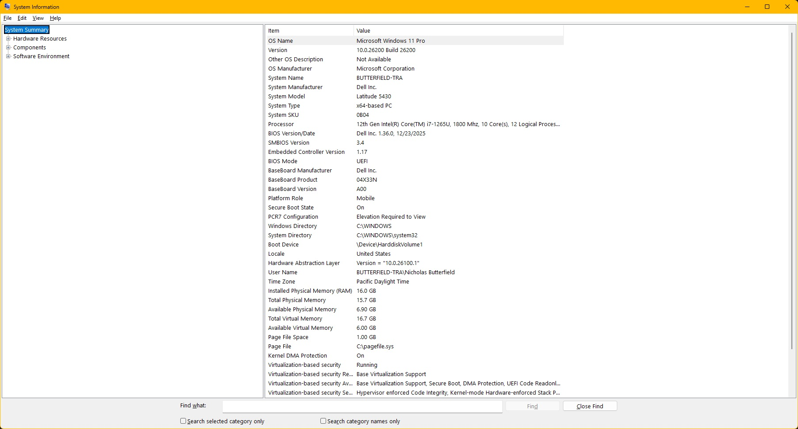

# Project-Ghost-Machine
Hardening a Dell Latitude 5430: Fedora Linux migration, Sway TWM implementation, and 64GB RAM physical upgrade logs
### 📸 Baseline Evidence

*Figure 1: Task Manager showing 16GB Baseline and factory idle usage on the Dell Latitude 5430.*
